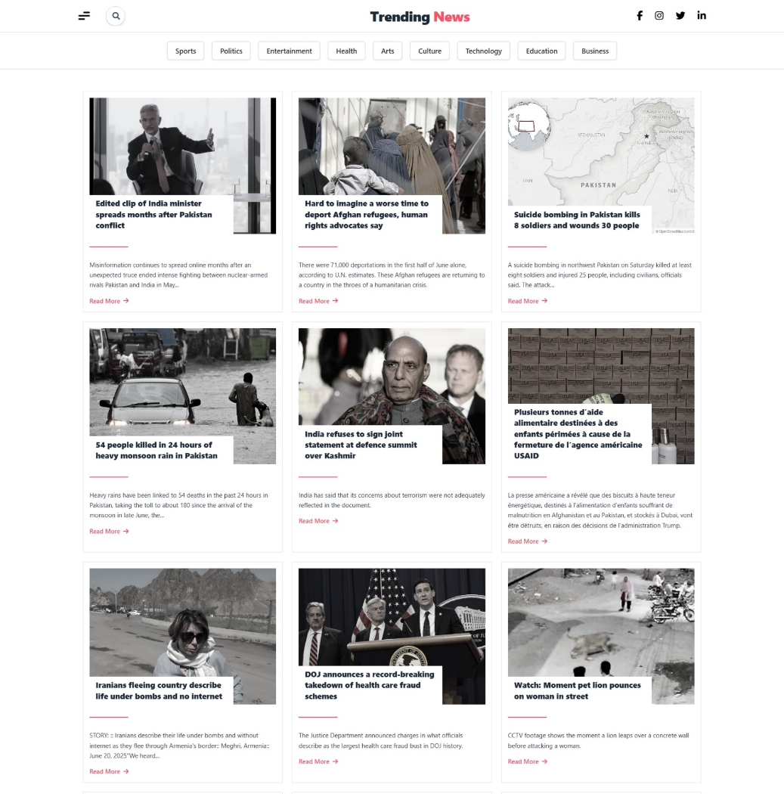

# 📰 News Website - API Based Project

This is a modern, responsive news website built with **React + Vite**, styled using **Tailwind CSS**, and powered by the [NewsAPI.org](https://newsapi.org/) to fetch real-time news articles. The app features dynamic search, category filtering, and a smooth user experience across all devices.

---

## 🌟 Features

- 🔍 Real-time News Search  
- 🗂️ Category Buttons (Sports, Technology, Politics, etc.)  
- 📱 Fully Responsive Design  
- 🎨 Styled with Tailwind CSS  
- 🚀 Built with Vite for Fast Development  
- 🌐 API Integration with [NewsAPI](https://newsapi.org/)  
- 📜 Clean, modular React components  
- 🧼 Error handling for empty or missing data  
- ⬆️ Scroll-to-top button functionality  

---

## 🧰 Tech Stack

- **React** – Component-based UI  
- **Vite** – Lightning-fast frontend tooling  
- **Tailwind CSS** – Utility-first styling  
- **NewsAPI** – Fetching up-to-date news  
- **Font Awesome** – Social and UI icons  

---

## 📁 Folder Structure

```text
src/
│
├── components/              # Reusable UI components
│   ├── Card.jsx             # Displays each news card
│   ├── Menubar.jsx          # Sidebar with category filters
│   ├── SearchBar.jsx        # Search input box
│   ├── ScrollTopButton.jsx  # Scroll to top button
│   ├── MobileMenuBar.jsx    # Navbar for mobile view
│
├── Newsapp.jsx              # Main logic for fetching and rendering news
└── App.jsx                  # Entry point of the React app
```
## 🚀 Getting Started

### 1. Clone the Repository

```bash
git clone https://github.com/saeedasaad/news-website.git
cd news-website
```

### 2. Install Dependencies

```bash
npm install
```
### 3. Setup NewsAPI Key

```bash
VITE_NEWS_API_KEY=your_api_key_here

```
### 4. Run the App

```bash
npm run dev
```

##📷 Screenshots

### 🏠 Home Page



##🔐 Environment Variables

Key	Description
VITE_NEWS_API_KEY	Your NewsAPI API key

##🧪 Future Improvements
-Add pagination or infinite scroll
-Integrate a dark/light mode toggle
-Add localization support
-Add loading spinner or skeletons

##📄 License

This project is licensed under the MIT License.

##🙌 Acknowledgements
NewsAPI.org

Vite

Tailwind CSS

Font Awesome

##✨ Live Demo

---

Would you like me to generate a `.env` example file or a `LICENSE` file too?